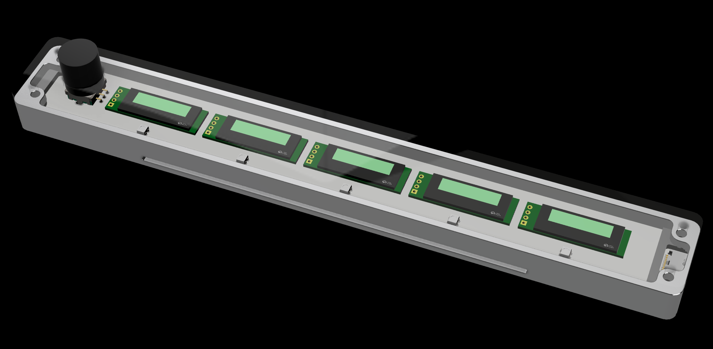

# Glowbug



[](https://glowbug.dev)

## What is Glowbug?

Glowbug is a device that enables AI coding agents (Claude Code, Codex,
Cursor, etc.) to get your attention by beeping, flashing, changing color, and
writing messages on its 5 OLED screens.

## Who is it for?

People who run a few AI coding agents at once -- Claude Code, Codex, Cursor,
Antigravity, any mix -- on a Mac.

## What does it do?

Every running agent gets a screen with its name. The light above it says
what it's up to:

| light | meaning |
|---|---|
| dark | idle |
| violet, breathing | thinking |
| ember, with a chime | it asked you a question |
| pink pulse, with a chime | it's waiting for permission |
| green pulse, with a ding | it just finished |
| red blink | error |

It only watches. It never gets a say in what an agent does, and it never
shows an agent that isn't there. More than five agents? The row scrolls;
turn the knob. Click the knob for brightness, sound and the rest.

What each tool can tell it:

| | thinking | question | permission | done | error | closed |
|---|---|---|---|---|---|---|
| **Claude Code** | ✓ | ✓ | ✓ | ✓ | ✓ | ✓ |
| **Cursor** | ✓ | — | — | ✓ | ✓ | ✓ |
| **Codex** | ✓ | — | ✓ | ✓ | — | ✓ |
| **Antigravity** | ✓ | — | — | ✓ | ✓ | after a while |

The dashes are honest gaps -- those tools don't have a safe event for that
moment.

## Your own programs

The screens, lights and buzzer are yours too:

```sh
glowbug show 3 --color green --line1 "Build OK" --sound ding --for 5
```

Five seconds later the screen goes back to your agent. Same from Python or
any language. Reference: [API.md](API.md). Scripts to start from:
[examples/](examples/).

## How do I set it up?

- [<ins>Buy a Glowbug device</ins>](https://glowbug.dev)
- Install the software, any of these ways:
  - Tell Claude Code: `Install glowbug from github.com/pud/glowbug`
  - `brew install pud-blip/tap/glowbug && glowbug install`
  - `pipx install glowbug && glowbug install`
  - `git clone https://github.com/pud/glowbug && cd glowbug && python3 glowbug.py install`
- Plug in the Glowbug and restart any agent sessions you already had open.
  `glowbug status` tells you if it's healthy.

## How does it work?

```
Claude Code ──┐
Cursor ───────┤ hooks ──▶ glowbug.py (daemon) ──USB──▶ Glowbug
Codex ────────┤
Antigravity ──┘
```

The AI tools you use already announce what they're doing via hooks. The
Glowbug daemon listens to these hooks and tells the Glowbug device what to do
(what lights to light up, which colors, etc).

## What it can see

- No network code. Search the repo for `http`; there is nothing.
- The hook forwards eight fields: event name, session id, session title,
  working directory, tool name, error type, which tool, idle flag. Never your
  prompts, never tool arguments, never file contents.
- The device only ever gets a session's name and one status word.

## If something goes wrong

`glowbug rescue` puts the known-good firmware back over USB, even on a board
that has stopped talking (hold the knob while plugging in). Everything else:
[TROUBLESHOOTING.md](TROUBLESHOOTING.md).

## Requirements

- macOS, Python 3.9+ (the built-in one is fine)
- One or more of: Claude Code, Cursor 1.7+, Codex (with `features.hooks`
  on), Antigravity 2.0+
- A Glowbug

## Uninstall

```sh
python3 ~/.glowbug/glowbug.py uninstall
```

## License

MIT -- see [LICENSE](LICENSE).
